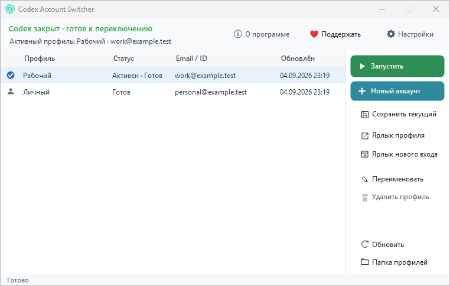

# Codex Account Switcher

[Русский](README.md) | [English](README.en.md)

Локальная Windows-утилита для сохранения и быстрого переключения аккаунтов в приложении Codex Desktop.

Программа позволяет сохранять авторизации под понятными именами, безопасно переключаться между ними в один клик, запускать Codex и создавать ярлыки на рабочем столе для каждого аккаунта или для нового входа.

Поддерживаются **как официальная версия из [Microsoft Store](https://apps.microsoft.com/detail/9nxq8fg885bb) / установщика, так и любые Portable-сборки** Codex.

**Версия:** 1.0.0  
**Автор:** [CodoMagia](https://github.com/codomagia)  
**Поддержать:** [Boosty](https://boosty.to/codomagia/donate)

Готовые сборки — в [Releases](https://github.com/codomagia/CodexAccountSwitcher/releases).

## Внешний вид

## Скачать

1. Откройте [последний Release](https://github.com/codomagia/CodexAccountSwitcher/releases/latest).
2. Скачайте `Codex-Account-Switcher-1.0.0.zip`.
3. Распакуйте архив в постоянную папку.
4. Запустите `Codex Account Switcher.exe`.
5. При необходимости укажите путь к `ChatGPT.exe` или `codex.exe` в настройках (либо программа определит его автоматически при запуске).

Установка не требуется. Не запускайте программу прямо из ZIP-архива.

## Системные требования

- Windows 10 или Windows 11
- .NET Framework 4.7.2 или новее
- Приложение Codex Desktop:
  - Официальная версия из [Microsoft Store](https://apps.microsoft.com/detail/9nxq8fg885bb) или инсталлятора
  - **ИЛИ** любая автономная Portable-версия с `ChatGPT.exe` / `codex.exe`

## Возможности

- **Поддержка любых версий:** полноценно работает и с установленной версией (включая Microsoft Store), и с автономными Portable-сборками.
- **Несколько профилей:** сохранение любого количества аккаунтов под понятными именами.
- **Безопасное переключение:** валидация до и после, автоматический откат авторизации при сбое.
- **Автосохранение сессии:** автоматическое обновление данных текущего профиля перед переключением.
- **Быстрый запуск и ярлыки:** создание ярлыков на рабочем столе для мгновенного входа в конкретный профиль или в режим новой сессии.
- **Автоматическое обнаружение:** утилита сама видит активные процессы Codex в системе и блокирует операции во время работы, защищая профили от повреждения.
- **100% автономность:** утилита работает локально, без телеметрии и без отправки данных на сторонние серверы.

## Как пользоваться

1. Закройте Codex, если он запущен.
2. Сохраните текущий аккаунт как новый профиль (кнопка «Сохранить профиль»).
3. Для переключения выберите нужный профиль из списка и нажмите «Запустить».
4. Для создания новой сессии нажмите «Новая сессия».

## Лицензия

Copyright © 2026 CodoMagia. Все права защищены.

Разрешается:
- свободно скачивать и использовать программу;
- распространять неизменённый официальный дистрибутив.

Не допускается:
- изменение программы и распространение изменённых копий;
- выдача программы за чужую или удаление сведений об авторе.
